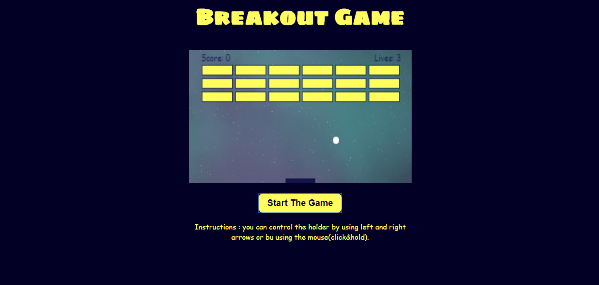

# Project #1

## Breakout Game

In this game the player have scores and lives, so if the player hit one brick he will get one score, and if the player distroy all the bricks then we have a WINNER,but whenever the ball touches the bottom wall the player will lose one life so you need to make the holder hit the ball if there are no more lives left then GAME OVER (:

## Technologies

- landing page is done using - **HTML/CSS**
- the logic inside of the game is done using -**JavaScript**
- accessing HTML elements to add events is done with **DOM Manipulate**
- **Canvas** - and some functions inside the canvas to draw the shapes

---

## Installation Instructions

- No need to do any installation ,just download the repo then open the index.html file and enjoy the game (:

## Unsolved Problems

- there is one problem that i tried to solve but i couldn't : **when the player hit the ball by the holder from the left corner the ball will disappear and you will need to refresh the game to play again..**

## Some Additional Information 

- Every thing inside the canvas is draw using canvas functions.